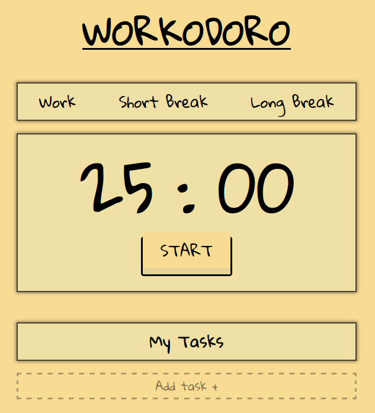
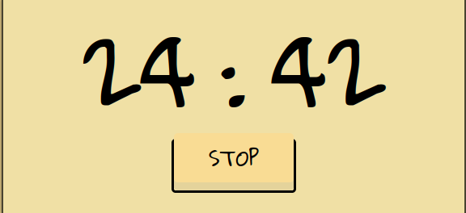
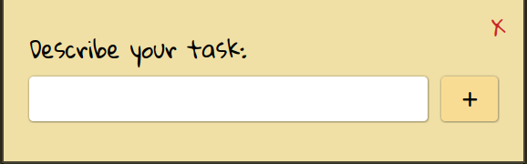
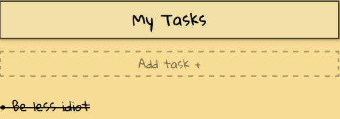

# Workodoro  
*Uma aplicação simples baseada na técnica Pomodoro.*

<table>
  <tr>
    <td width="350">Inicie o cronômetro para começar a utilizar a aplicação.</td>
    <td width="350"></td>
  </tr>
  
  <tr>
    <td></td>
    <td>Experimente os diferentes modos de tempo disponíveis.</td>
  </tr>

  <tr>
    <td>O cronômetro pode ser pausado ou interrompido a qualquer momento.</td>
    <td></td>
  </tr>

  <tr>
    <td></td>
    <td>É possível adicionar tarefas clicando no botão <strong>"Adicionar tarefa"</strong>, que abrirá uma janela para inserção.</td>
  </tr>
  
  <tr>
    <td>Ao clicar em uma tarefa concluída, ela será marcada e removida após a atualização da página.</td>
    <td></td>
  </tr>
</table>

## Tecnologias
- JavaScript
- HTML
- CSS

## Objetivo do Projeto

Este projeto foi desenvolvido com o objetivo de praticar conceitos fundamentais de JavaScript e lógica de programação.  

Como iniciante na linguagem, busquei consolidar conhecimentos básicos por meio da construção de projetos práticos, reforçando a compreensão da sintaxe, manipulação de eventos, controle de tempo e gerenciamento de estado no navegador.
