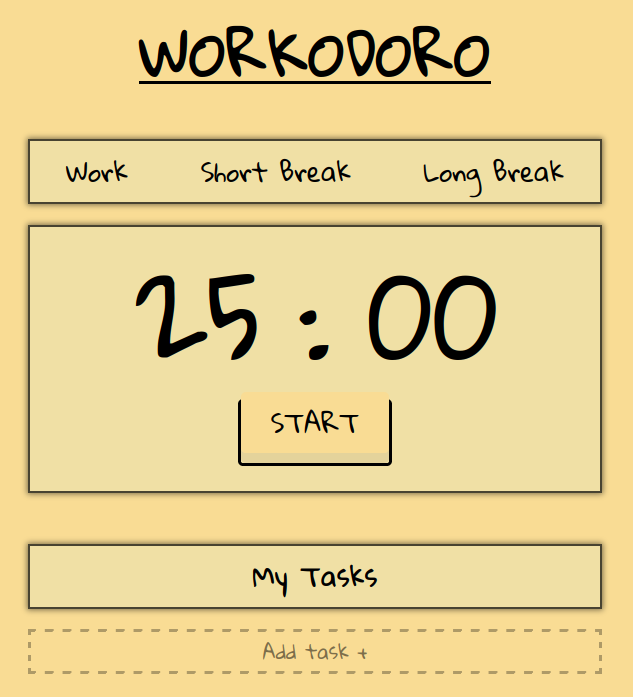

# Workodoro
*just another pomodoro...*

<table>
  <tr>
    <td width="350">Just start it please</td>
    <td width="350"></td>
  </tr>
  
  <tr>
    <td></td>
    <td>Let's test our time modes, genius</td>
  </tr>

  <tr>
    <td>Probably you will not figure it out, but you can stop the timer</td>
    <td></td>
  </tr>

  <tr>
    <td></td>
    <td>Add tasks, don't be a lazy ass. Just click on <strong>"add task"</strong> button and this window will pop-up</td>
  </tr>
  
  <tr>
    <td>This time i will not judge you for don't knowing how. Click on the task that you added and see it being struck through and removed after refresh page.</td>
    <td></td>
  </tr>
</table>

*Nothing's new, no?*

## Technologies
- A little of Java
- And a little of Script

## The "why" of it?
*Boredom, just kidding :)*

I still a completely newbie in Javascript, so let me cook. I need to develop the basics projects to learn more about the syntax of the language and about programming as well, i'm just another dumb programmer that get excited when seeing my little programs coming to life, accept it.
